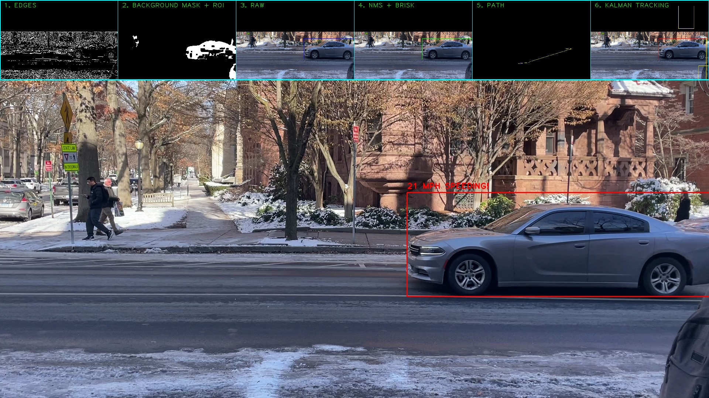

# Speeding Vehicle Detection System

This project monitors vehicles passing through the Hillhouse and Grove Avenue intersection, tracks their speeds, and saves the side profiles of speeding offenders.




## Instructions for Testing

I use UV for package management. All required packages are listed in the [pyproject.toml](pyproject.toml) file.

### Prerequisites

- Python 3.13 or higher
- UV package manager (install from [https://docs.astral.sh/uv/](https://docs.astral.sh/uv/))
- OpenCV-compatible video files (provided in [data/](data/) directory)

### Environment Setup

1. Install UV:

   ```bash
   curl -LsSf https://astral.sh/uv/install.sh | sh
   ```

2. Install dependencies:

   ```bash
   uv sync
   ```

   This will create a virtual environment in `.venv` and install all required packages:
   - opencv-python (4.11.0.86+)
   - numpy (2.3.5+)
   - scipy (1.16.3+)
   - filterpy (1.4.5+)
   - matplotlib (3.10.7+)
   - jupyter (1.1.1+)
   - imageio (2.37.2+)
   - ipywidgets (8.1.8+)

### Running the Notebook

```bash
# launch Jupyter, I would HIGHLY recommend running this on your laptop (i.e. not in colab) because then you will see the entire detection pipeline pop up immediately. Note that this is dependent on your computer having enough processing power to keep this realtime. Performance will very. On my macbook m2 it appears realtime.)
uv run jupyter notebook speeding_car_detection.ipynb

# then, simply run all cells.
```

### Testing data

Available test videos in the [data/](data/) directory:

- `clip1.MOV` - Short test clip,
- `clip2.MOV` - Medium test clip
- `clip3.MOV` - Short test clip, includes speeding cars
- `full_recording.mov` - Full 10-minute recording of hillhouse av & grove intersection

Id recommend using clip3.MOV to verify the system works for the sake of your grading. You could also just view the outputs folder for some runs that I've already generated to save some time. To use a different video file, update the `VIDEO_SOURCE` variable in [speeding_detection_v4.py](speeding_detection_v4.py#L8).

### Verify Environment Setup

1. Verify environment setup:

   ```bash
   uv run python -c "import cv2, numpy, scipy, filterpy; print('All packages imported successfully')"
   ```

2. check video file exists:

   ```bash
   ls -lh data/clip1.MOV
   ```

3. Run a quick test with a short clip:

   ```bash
   # edit speeding_detection_v4.py to use a short clip first
   # change: VIDEO_SOURCE = "./data/clip3.MOV"
   uv run python speeding_detection_v4.py
   ```

### Troubleshooting

Issue: `Video file not found`

- Ensure the video file path in `VIDEO_SOURCE` is correct. Use relative paths from the project root (e.g., `"./data/clip1.MOV"`). Make sure the pathing works for YOUR system.

Issue: Display window doesn't appear automatically

- Ensure you are running on a system with GUI support. If running headless, comment out `cv2.imshow()` and `cv2.waitKey()`

## Project Overview

This project implements the algorithm described in the CPSC5800 project proposal. It monitors vehicles passing through the Hillhouse and Grove Avenue intersection, tracks their speeds, and saves the side profiles of speeding offenders

## Data

I created my own dataset for testing. I recorded the hillhouse and grove intersection for 10 minutes. This raw feed is saved under /data/full_recording.mov. We leverage clips from that 10 minute recording for rapid iteration and testing (denoted clip1.MOV, clip2.MOV, clip3.MOV).
